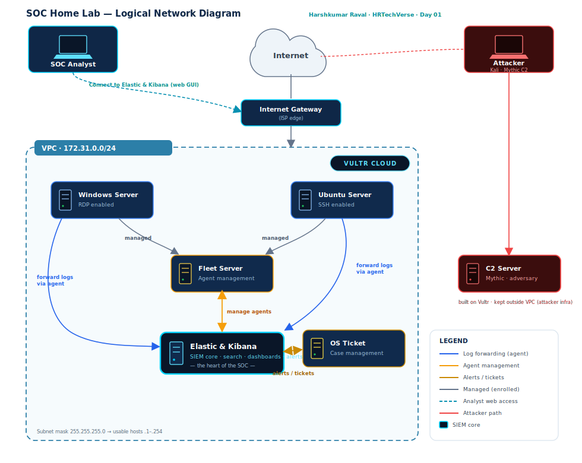

# Day 01 — Building the Logical Network Diagram

> **Challenge:** [30 Days SOC Analyst Challenge](https://www.youtube.com/@MyDFIR) by Steven (MyDFIR)
> **Status:** ✅ Complete | **Tool:** [draw.io](https://draw.io)
> **Deliverable:** A logical network diagram of the full SOC home lab.

---

## 🎯 Objective

Before provisioning any infrastructure, a SOC analyst maps the environment. Day 1 builds a **logical network diagram** in draw.io that defines every server, how the network is segmented, and how data flows from endpoints into the SIEM. This becomes the blueprint the rest of the 30 days is built against.

> *"In the beginning it might feel pretty useless, but trust me — this is a skill that will be extremely helpful in the future."* — Steven (MyDFIR)

---

## 🖥️ The Six Servers

All servers run on the **Vultr** cloud provider. Five sit inside the private VPC; the C2 server is intentionally placed *outside* as adversary infrastructure.

| Server | Role | Purpose in the Lab |
|--------|------|--------------------|
| **Elastic & Kibana** | SIEM core | Stores, searches, and visualizes all logs; home of alerts & dashboards |
| **Windows Server** | Endpoint (RDP) | Monitored Windows host; RDP brute-force target later |
| **Ubuntu Server** | Endpoint (SSH) | Monitored Linux host; SSH brute-force target later |
| **Fleet Server** | Agent management | Enrolls and manages the agents that ship endpoint logs |
| **OS Ticket** | Case management | Ticketing system for alerts & investigations (Week 4) |
| **C2 Server** 🔴 | Adversary | Mythic command-and-control — placed outside the VPC |

---

## 🔀 Network & Data Flow

| Connection | Label | Meaning |
|------------|-------|---------|
| Windows / Ubuntu → Fleet | `managed` | Endpoints are enrolled and managed by Fleet |
| Fleet ↔ Elastic & Kibana | `manage agents` | Fleet coordinates agent policy with the SIEM (bidirectional) |
| Windows / Ubuntu → Elastic | `forward logs via agent` | Endpoint telemetry shipped into Elasticsearch |
| OS Ticket ↔ Elastic | `alerts / tickets` | Alerts become tickets; case status flows back (bidirectional) |
| SOC Analyst laptop → Elastic | `web GUI` | Analyst reaches Kibana over the internet via browser |
| Attacker laptop → C2 | `Kali · Mythic` | Attacker operates the C2 from outside the VPC |

---

## 🌐 VPC & Addressing

A **VPC (Virtual Private Cloud)** places all lab VMs on the same isolated private network.

- **Range:** `172.31.0.0/24`
- **Usable hosts:** `172.31.0.1` – `172.31.0.254`
- **Subnet mask:** `255.255.255.0`
- **Internet Gateway:** bridges the VPC to the public internet (acts like the ISP edge)

---

## 🛠️ draw.io Skills Practiced

- Naming the diagram; toggling grid / shadow / sketch styling
- Searching the shape library (`server`, `VPC`, `internet gateway`, `computer`)
- Duplicating shapes with `Ctrl + D`; layering with **To Back / To Front**
- Drawing **bidirectional arrows** and recoloring lines to encode meaning
- Straightening connectors via **Waypoint → Straight** for a cleaner layout
- Saving: `File → Save`

---

## ✅ Day 1 Checklist

- [x] Open draw.io and name the diagram
- [x] Place and label the six servers under the Vultr provider
- [x] Draw the VPC, internet gateway, and internet
- [x] Add the SOC analyst and attacker laptops
- [x] Connect all servers and color-code the data-flow arrows
- [x] Document the private network range and subnet mask
- [x] Save the diagram and commit it to the repo

---

## 💭 My Takeaway

The diagram isn't decoration — it's the mental model. Once the flow of *endpoint → agent → Fleet → Elastic → alert → ticket* is drawn out, every later day has a place to slot into. It also doubles as the single best artifact for explaining the lab to an interviewer in 30 seconds. **Reps on logical diagrams compound.**

> 📌 *Note to self:* the SVG in this repo is my polished reference. I still rebuilt it by hand in draw.io for the actual skill reps — the point of Day 1 is the practice, not the picture.

---

*Part of **Harshkumar Raval's** SOC Analyst portfolio — [HRTechVerse](https://www.youtube.com/).*
*"I think like an attacker to defend like a professional. Calm mind, relentless hunt."*
